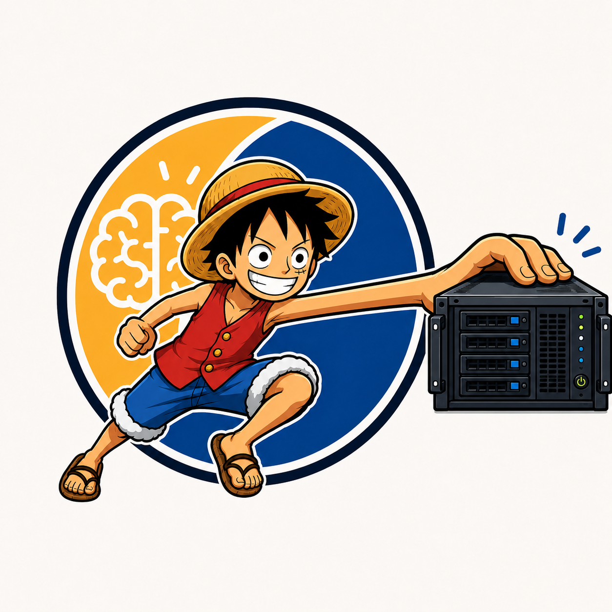
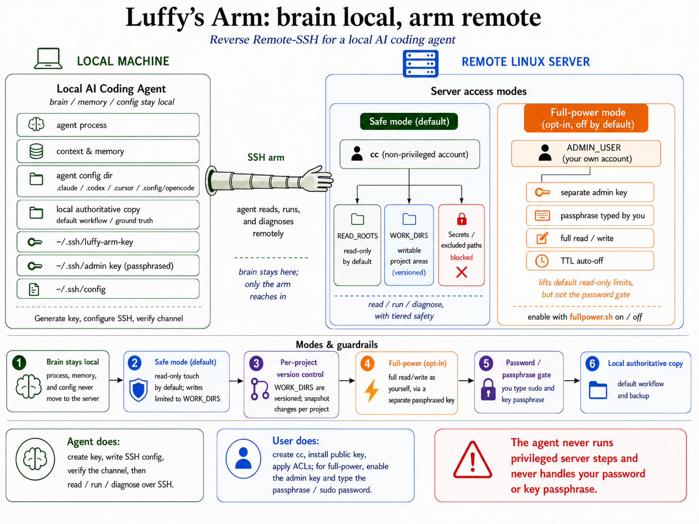

<p align="center">
  
</p>

<h1 align="center">🦾 Luffy's Arm</h1>

**Give a *local* AI coding agent a remote hand.** The agent's brain — its process,
config, and memory — stays on your machine; only a single SSH "arm" reaches into a
remote Linux server to **read, run, and diagnose**, behind tiered safety.

> It's the **inverse** of cloud dev / remote-control tools. Those move the compute to the
> server and have you steer a remote agent. luffy-arm keeps the agent **home** and lets it
> reach out — reverse Remote-SSH: *brain local, hand remote.*

Built entirely from **native parts** (SSH keys, `~/.ssh/config`, ControlMaster, POSIX
ACLs, ssh-agent). No daemon, no custom protocol, nothing to trust beyond OpenSSH.

> 👉 **New here? Start with [`TUTORIAL.md`](TUTORIAL.md)** — a complete, zero-assumptions
> walkthrough (no prior SSH knowledge needed; ~15 minutes from nothing to a working channel).

---

## Why

You write code locally and your data/compute live on a server. You want the agent to go
*look* at the data and *run* things there — without shipping your brain, memory, or
credentials to a shared box. luffy-arm is that channel, with guardrails.

## How it works

<p align="center">
  
</p>

**Tiered safety** (details in [`references/security-model.md`](references/security-model.md)):

1. 🔒 **sudo password gate** — `cc` is non-privileged; `sudo` needs a password only you know.
2. 👁 **data read-only (ACL)** — `cc` reads your `READ_ROOTS`; secrets are carved out.
3. ♻ **per-project version control** — `WORK_DIRS` are writable; you snapshot per project.
4. 🗄 **local authoritative copy** — your local source is the ground truth.

## Who does what

| The **agent** does (💻 local, after you authorize) | **You** do (🖥 server, with your sudo) |
|---|---|
| Generate the SSH key, write `~/.ssh/config`, verify the channel, then read/run/diagnose over `ssh` | Create the `cc` account, install the public key, apply the read/write ACLs |

The agent **never** runs the privileged server steps and **never** handles a password —
it hands you the exact commands; you run them. (See the invariants in the security model.)

## Install

**One command — auto-detects your agent(s)** and installs into the right skills dir for each
AI coding agent it finds (Claude Code, Codex, Cursor, OpenCode):
```bash
curl -fsSL https://raw.githubusercontent.com/Ares960826/luffy-arm/main/install.sh | bash
```
From a clone instead: `git clone https://github.com/Ares960826/luffy-arm && bash luffy-arm/install.sh`

<details><summary><b>Manual install</b> (clone straight into your agent's skills dir)</summary>

```bash
# Claude Code · Cursor · OpenCode (all read ~/.claude/skills/):
git clone https://github.com/Ares960826/luffy-arm ~/.claude/skills/luffy-arm

# Codex (reads ~/.agents/skills/ — NOT ~/.claude):
git clone https://github.com/Ares960826/luffy-arm ~/.agents/skills/luffy-arm
```
</details>

Then just tell your agent what you want — e.g. *"set up luffy-arm to my GPU box"* or
*"use luffy-arm to poke around my server"* — and it follows [`SKILL.md`](SKILL.md).
First time? The friendly end-to-end walkthrough is [`TUTORIAL.md`](TUTORIAL.md).

> **Cursor note:** Cursor is a GUI/IDE, not a headless CLI. The skill installs and works inside
> Cursor's agent chat, but each shell step goes through Cursor's command-approval UI — it can't
> be driven unattended the way Codex/OpenCode can.

**Via the toolkit:** it's also referenced from
[`ares-agent-toolkit`](https://github.com/Ares960826/ares-agent-toolkit) as a submodule.

## Quick start

```bash
# 1. fill in your params (kept OUTSIDE the repo)
mkdir -p ~/.config/luffy-arm && cp scripts/params.example.sh ~/.config/luffy-arm/params.sh
$EDITOR ~/.config/luffy-arm/params.sh

# 2. local: make the key + ssh config
bash scripts/keygen.sh        # prints the public key
bash scripts/ssh-config.sh

# 3. server (YOU, with sudo): see references/server-setup.md — create cc, install key, set ACLs

# 4. local: verify the channel + all safety nets
bash scripts/verify.sh        # → 🎉 all passed
```

Full hand-holding walkthrough: [`TUTORIAL.md`](TUTORIAL.md).

## Layout

```
TUTORIAL.md               # full human walkthrough — start here if you're new
SKILL.md                  # agent playbook (read first if you're an AI agent)
scripts/                  # safe mode:  keygen.sh · ssh-config.sh · verify.sh · grant.sh · params.example.sh
                          # full-power: admin-keygen.sh · fullpower.sh · verify-fullpower.sh
references/               # setup-guide.md · server-setup.md · security-model.md
```

## Scope

- **Safe mode (default):** `cc` reads your data, writes only in `WORK_DIRS`.
- **Full-power mode (opt-in, off by default):** log in as yourself for full read/write,
  controlled by a passphrase-protected key that auto-expires after a TTL. Enable with
  `admin-keygen.sh` → `fullpower.sh on`, verify with `verify-fullpower.sh`. You always type
  the passphrase (INV-3). Reasoning: [`references/security-model.md`](references/security-model.md).

## License

[MIT](LICENSE) © Ares960826
