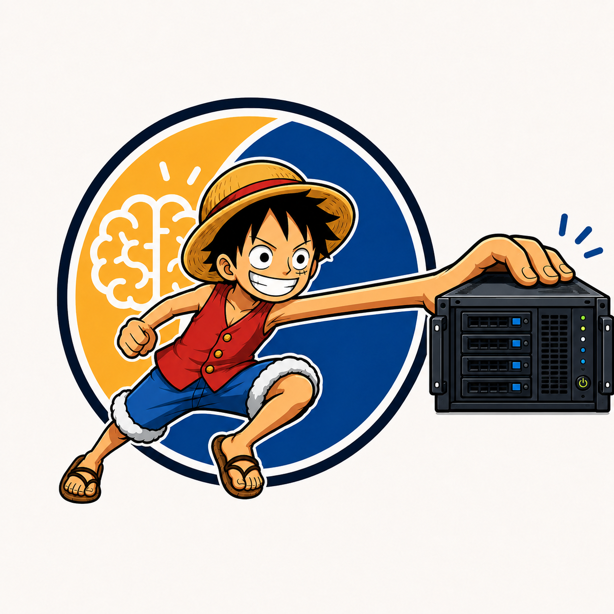
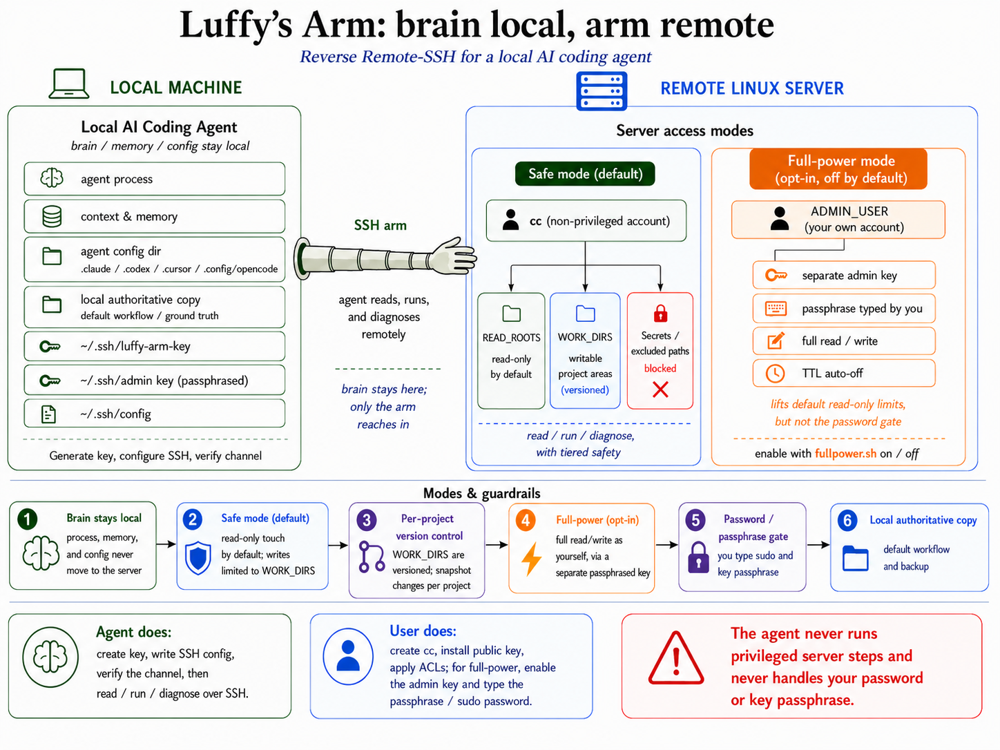

<p align="center">
  
</p>

<h1 align="center">🦾 Luffy's Arm</h1>

<p align="center">
  <a href="LICENSE"></a>
  
</p>

**Give a *local* AI coding agent a remote hand.** The agent's brain — its process,
config, and memory — stays on your machine; only a single SSH "arm" reaches into a
remote Linux server to **read, run, and diagnose**, behind tiered safety.

> It's the **inverse** of cloud dev / remote-control tools. Those move the compute to the
> server and have you steer a remote agent. luffy-arm keeps the agent **home** and lets it
> reach out — reverse Remote-SSH: *brain local, hand remote.*

Built entirely from **native parts** (SSH keys, `~/.ssh/config`, ControlMaster, POSIX
ACLs, ssh-agent). No daemon, no custom protocol, nothing to trust beyond OpenSSH.

> 👉 **New here? Start with [`TUTORIAL.md`](TUTORIAL.md)** — a complete, zero-assumptions
> walkthrough (no prior SSH knowledge needed; ~15 minutes from nothing to a working channel).

---

## Why

You write code locally and your data/compute live on a server. You want the agent to go
*look* at the data and *run* things there — without shipping your brain, memory, or
credentials to a shared box. luffy-arm is that channel, with guardrails.

## When you need this

- **A shared/institutional HPC or lab server where you *can't* install an AI agent** — no
  root, no outbound network, or policy forbids it; SSH/SFTP is the only way in. luffy-arm
  keeps the agent on your laptop and gives it a hand on the server.
- **Your data is too big to sync down** — the agent explores and filters it in place and
  pulls back only the results.
- **You want AI hands on a box, but with OS-enforced guarantees** — a dedicated
  unprivileged account, read-only ACLs, no `sudo` without your password.
- **One setup serves every agent you use** — Claude Code, Codex, Cursor, OpenCode.

## How it works

<p align="center">
  
</p>

**Tiered safety** (details in [`references/security-model.md`](references/security-model.md)):

1. 🔒 **sudo password gate** — `cc` is non-privileged; `sudo` needs a password only you know.
2. 👁 **data read-only (ACL)** — `cc` reads your `READ_ROOTS`; secrets are carved out.
3. ♻ **per-project version control** — `WORK_DIRS` are writable; you snapshot per project.
4. 🗄 **local authoritative copy** — your local source is the ground truth.

Optional 📓 **command auditing** (off by default): a server-side `sshd` wrapper logs every
command the agent runs as `cc` to the root-owned journal — *detect, not prevent*. Turn it
on/off with `scripts/gen-audit-setup.sh` ([`references/audit-logging.md`](references/audit-logging.md)).

## Who does what

| The **agent** does (💻 local, after you authorize) | **You** do (🖥 server, with your sudo) |
|---|---|
| Generate the SSH key, write `~/.ssh/config`, verify the channel, then read/run/diagnose over `ssh` | Create the `cc` account, install the public key, apply the read/write ACLs |

It hands you the exact privileged commands; you run them with your sudo
([security model](references/security-model.md)).

## Prerequisites

- **Local:** an AI CLI agent (Claude Code / Codex / Cursor / OpenCode) + OpenSSH.
- **Remote:** Linux with `sshd` + the `acl` package + a sudo-capable human (one-time setup only).

## Install

**Claude Code — via the plugin marketplace** (recommended; gets you one-command updates, and
opt-in auto-update):
```text
/plugin marketplace add Ares960826/ares-agent-toolkit
/plugin install luffy-arm@ares-toolkit
```

**Any agent — one command** that auto-detects your agent(s) and installs the main skill plus the
independent full-power ON/OFF switches into the right skills dir for each (Claude Code, Codex,
Cursor, OpenCode):
```bash
curl -fsSL https://raw.githubusercontent.com/Ares960826/luffy-arm/main/install.sh | bash
```
From a clone instead: `git clone https://github.com/Ares960826/luffy-arm && bash luffy-arm/install.sh`

<details><summary><b>Manual install</b> (clone straight into your agent's skills dir)</summary>

```bash
# Claude Code · Cursor · OpenCode (all read ~/.claude/skills/):
git clone https://github.com/Ares960826/luffy-arm ~/.claude/skills/luffy-arm
LUFFY_ARM_DIR=~/.claude/skills bash ~/.claude/skills/luffy-arm/install.sh

# Codex (reads ~/.agents/skills/ — NOT ~/.claude):
git clone https://github.com/Ares960826/luffy-arm ~/.agents/skills/luffy-arm
LUFFY_ARM_DIR=~/.agents/skills bash ~/.agents/skills/luffy-arm/install.sh
```
</details>

Then just tell your agent what you want — e.g. *"set up luffy-arm to my GPU box"* or
*"use luffy-arm to poke around my server"* — and it follows [`SKILL.md`](SKILL.md).
After full-power setup, *"turn on full power"* and *"turn off full power"* route to separate,
purpose-built companion switch skills. Skill hosts do not currently expose true parent/sub-skill
metadata, so the operations remain independently invokable while their UI labels group them as
`Luffy Arm › Full Power ON/OFF`. ON remains passphrase-gated and must be run by you.
First time? The friendly end-to-end walkthrough is [`TUTORIAL.md`](TUTORIAL.md).

> **Upgrading to 1.7.0:** after updating, run `luffy-arm ssh-config` once. This connects the
> existing admin alias to luffy-arm's stable, user-private agent socket so one interactive ON can
> be recognized by separate agent conversations. Your key, passphrase, server address, and other
> SSH connection fields are not changed.

> **Cursor note:** Cursor is a GUI/IDE, not a headless CLI. The skill installs and works inside
> Cursor's agent chat, but each shell step goes through Cursor's command-approval UI — it can't
> be driven unattended the way Codex/OpenCode can.

**Via the toolkit:** it's also referenced from
[`ares-agent-toolkit`](https://github.com/Ares960826/ares-agent-toolkit) as a submodule.

## Quick start

**The easy way — let your agent drive it.** After installing, just say:

> *"Use luffy-arm to set up access to my server."*

The agent configures everything local automatically, interviews you for the details, and hands
you **one** server command to run. You only ever do the parts it can't (type your sudo password
on the server). See [`SKILL.md`](SKILL.md) for exactly what it does.

<details><summary><b>By hand</b> (same steps, if you'd rather run them yourself)</summary>

```bash
# 1. fill in your params (kept OUTSIDE the repo)
mkdir -p ~/.config/luffy-arm && cp scripts/params.example.sh ~/.config/luffy-arm/params.sh
$EDITOR ~/.config/luffy-arm/params.sh

# 2. local: make the key + ssh config
bash scripts/keygen.sh        # prints the public key
bash scripts/ssh-config.sh

# 3. generate the filled-in server script, then run it ON THE SERVER (you, with sudo)
bash scripts/gen-server-setup.sh          # writes luffy-arm-server-setup.sh
#   scp luffy-arm-server-setup.sh you@server:~/ && ssh you@server 'bash luffy-arm-server-setup.sh'

# 4. local: verify the channel + all safety nets
bash scripts/verify.sh        # → 🎉 all passed
```
</details>

Full hand-holding walkthrough: [`TUTORIAL.md`](TUTORIAL.md).

## Updating

luffy-arm tells you when a newer version is published (`verify.sh` prints a one-line nudge), and
upgrading is one step:

- **Claude Code (plugin marketplace):** `/plugin update luffy-arm@ares-toolkit`. To keep it
  **automatic**, turn on auto-update once: `/plugin` → **Marketplaces** → select *ares-toolkit*
  → **Enable auto-update**. (Third-party marketplaces don't auto-update until you flip that
  switch — deliberate, for a tool that touches SSH. Prefer to review changes first? Leave it off
  and run `/plugin update` when you want.)

  <details><summary>Org admins: push auto-update to everyone via managed settings</summary>

  ```json
  // managed-settings.json (admin/managed scope — NOT user settings.json)
  {
    "extraKnownMarketplaces": {
      "ares-toolkit": {
        "source": { "source": "github", "repo": "Ares960826/ares-agent-toolkit" },
        "autoUpdate": true
      }
    }
  }
  ```
  </details>
- **Codex / Cursor / OpenCode / curl installs:** `bash scripts/update.sh` (pulls the latest and
  re-installs into every detected agent).

## Fetching data to your machine

Pulling server data down to where the brain lives is a core use — anything `cc` can **read**
(your `READ_ROOTS`, minus the `READ_EXCLUDES` secrets) comes down over the same host alias:
```bash
scp mybox:/data/run42/metrics.json ./                        # one file
rsync -avz --partial --progress mybox:/data/run42/ ./run42/  # a directory (resumable)
ssh mybox "tar czf - /data/run42" | tar xzf -                # stream a whole tree, no temp files
```
Secrets in `READ_EXCLUDES` can't be read, so they can't be pulled; uploads land only in
`WORK_DIRS`.

## The `luffy-arm` command (optional shortcut)

`install.sh` also drops a `luffy-arm` command into `~/.local/bin` — a thin wrapper so you can
type short subcommands instead of full script paths:

```bash
luffy-arm help                 # list everything
luffy-arm verify               # safe-mode channel + safety-net check
luffy-arm fullpower on|off     # opt-in write-as-yourself (you type the passphrase)
luffy-arm fullpower-on|off     # intent-shaped aliases used by the switch skills
luffy-arm audit-gen            # generate the opt-in server audit script
luffy-arm setup | grant | update | …
```

It forwards to the same `scripts/*.sh` and **changes no behavior** — every passphrase and sudo
prompt is exactly as before. It's a symlink, so it tracks updates; remove it with
`rm ~/.local/bin/luffy-arm`. The installer also adds a shorter **`luffy`** alias (so `luffy
verify` works too) — but only when no other `luffy` is already on your PATH, since an unrelated
Homebrew CLI ships that name; if it's taken, the installer says so and you keep `luffy-arm`. The
AI agent doesn't use this; it calls the scripts directly.

## Layout

```
TUTORIAL.md               # full human walkthrough — start here if you're new
SKILL.md                  # agent playbook (read first if you're an AI agent)
agents/openai.yaml        # OpenAI agent interface config (display name & short description)
skills/                   # companion luffy-arm-fullpower-on / -off switch skills + UI labels
scripts/                  # dispatcher: luffy-arm  (the `luffy-arm <cmd>` command)
                          # safe mode:  keygen.sh · ssh-config.sh · gen-server-setup.sh · verify.sh · grant.sh · params.example.sh
                          # full-power: admin-keygen.sh · fullpower.sh · verify-fullpower.sh
                          # auditing:   gen-audit-setup.sh  (opt-in command log)
                          # upkeep:     update.sh · check-update.sh
references/               # setup-guide.md · server-setup.md · security-model.md · audit-logging.md
```

## Scope

- **Safe mode (default):** `cc` reads your data, writes only in `WORK_DIRS`.
- **Full-power mode (opt-in):** the dedicated luffy-arm credential is gated by a passphrase only
  you type and auto-expires by TTL. Status separately reports the actual remote identity and any
  alternate SSH credential that still reaches your user account. How & why:
  [`references/security-model.md`](references/security-model.md).
- **Layered, sandbox-safe state:** status distinguishes the dedicated gate from effective
  `ADMIN_USER` access. Gate OFF never implies Safe Mode if another key still authenticates as the
  same remote user. A sandbox or network failure is never mislabeled as OFF. In a runtime known to sandbox SSH/ssh-agent, the
  agent should request narrowly scoped host execution from the first probe instead of testing the
  sandbox first; a normal-terminal user check is only the fallback. The ON command publishes a
  stable agent socket reference under `~/.config/luffy-arm/`, so separate conversations do not
  depend on their inherited `SSH_AUTH_SOCK` value.

## Support & issues

Found a bug or want a feature? Open an issue — templates guide you. Vulnerabilities:
[SECURITY.md](.github/SECURITY.md).
Stuck? Troubleshooting lives in [`TUTORIAL.md`](TUTORIAL.md) §7 and
[`references/setup-guide.md`](references/setup-guide.md).

## License

[MIT](LICENSE) © Ares960826
